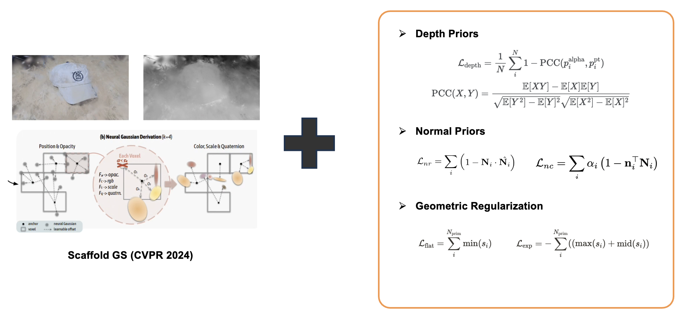

Development of cutting-edge deep learning technology for 3D reconstruction using only a few-shot of images.

<!--more-->

Reconstructing high-quality 3D models from sparse visual data is a long-standing challenge in computer vision. In our latest work, we tackle this problem using a few-shot learning approach built on the recently popularized 3D Gaussian Splatting framework. Our goal was to develop an effective pipeline that could reconstruct faithful 3D representations of real-world objects — such as SNU souvenirs — from just a small set of input images.

We propose three main improvements over the baseline:  
	1.	Depth Loss: Using “Depth Anything” and Pearson correlation-based depth consistency improved SSIM while maintaining competitive perceptual quality (LPIPS).  
	2.	Normal Loss: Leveraging normals from StableNormal and enforcing self-consistency and unseen-view consistency enhanced fine geometric details and visual fidelity.  
	3.	Geometric Loss: A novel combination of flattening and expansion losses guided primitive shapes for more compact and accurate reconstructions.

Together, these additions improved the PSNR from 19.28 (baseline) to 20.02, and LPIPS from 0.448 to 0.371 under few-shot settings 

[Live Demo](https://cv.snu.ac.kr/research/snu_demo_2024/)