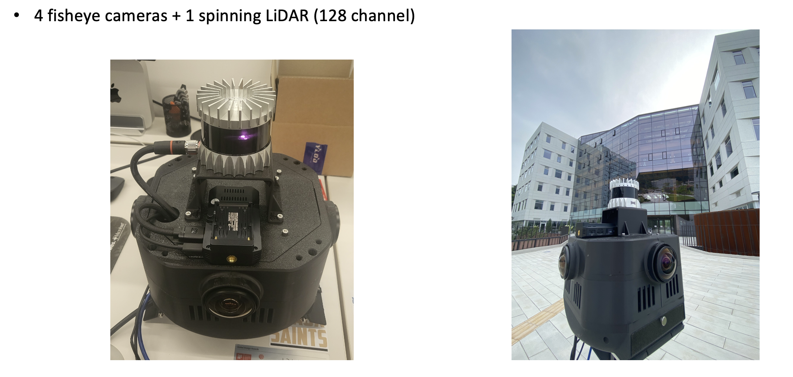
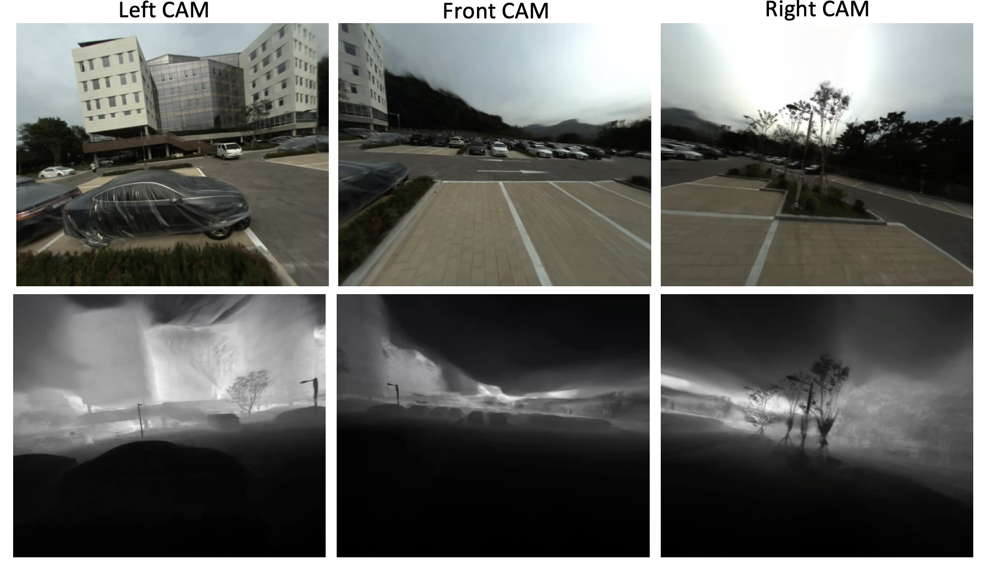

High-Precision Outdoor 3D Color Mapping Using LiDAR and Camera Sensor Capture Systems.

<!--more-->



This project was carried out to introduce the Haedong Advanced Engineering Hall, a new building at Seoul National University. This project page was created to capture the exterior of the Haedong Advanced Engineering Hall and visualize the reconstructed results. We generated a LiDAR prior map using a LiDAR SLAM-based method and estimated the camera poses through our point cloud-based Structure-from-Motion (SfM) technique. By accurately determining the camera positions, we reconstructed large-scale outdoor scenes in block units. This process allowed us to produce a high-quality, colorized point cloud and achieve high-fidelity rendered videos using 3D Gaussian Splatting. You can explore more detailed results on the webpage below.

Subsequently, we built a system capable of processing both LiDAR and camera data for 3D neural modeling based on 3D Gaussian Splatting. To handle large-scale sensor data efficiently, we introduced a distributed processing technique called Trajectory Chunking.

