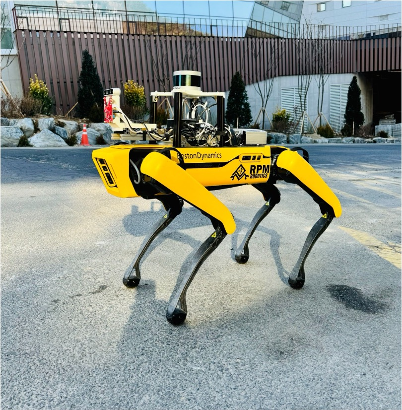
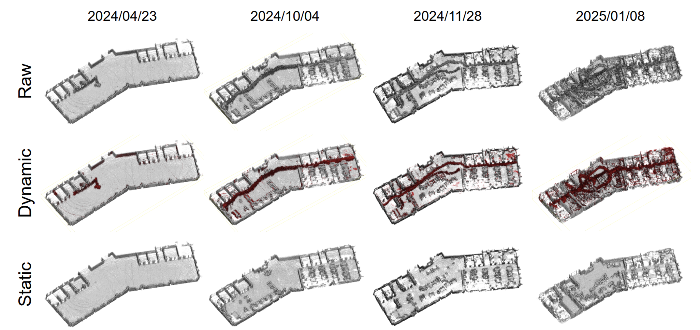

"Development of SLAM Technology for Robots Adaptable to Temporal Changes”.

<!--more-->

- Single-session Static Mapping (Dynamic Object removal)
- Multi-session Static Mapping (Lifelong Mapping)

LiDAR rig was mounted on a quadruped robot, and the same environment was mapped at appropriate time intervals. Subsequently, a mapping system was developed that can recognize dynamic and static objects and reflect changes in the environment.

